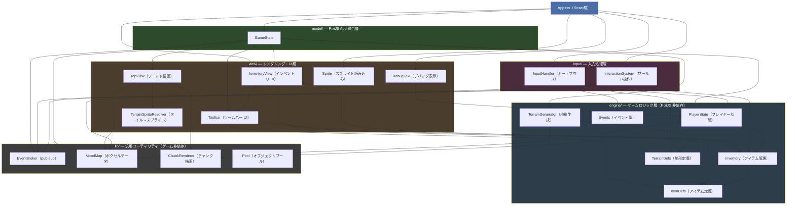
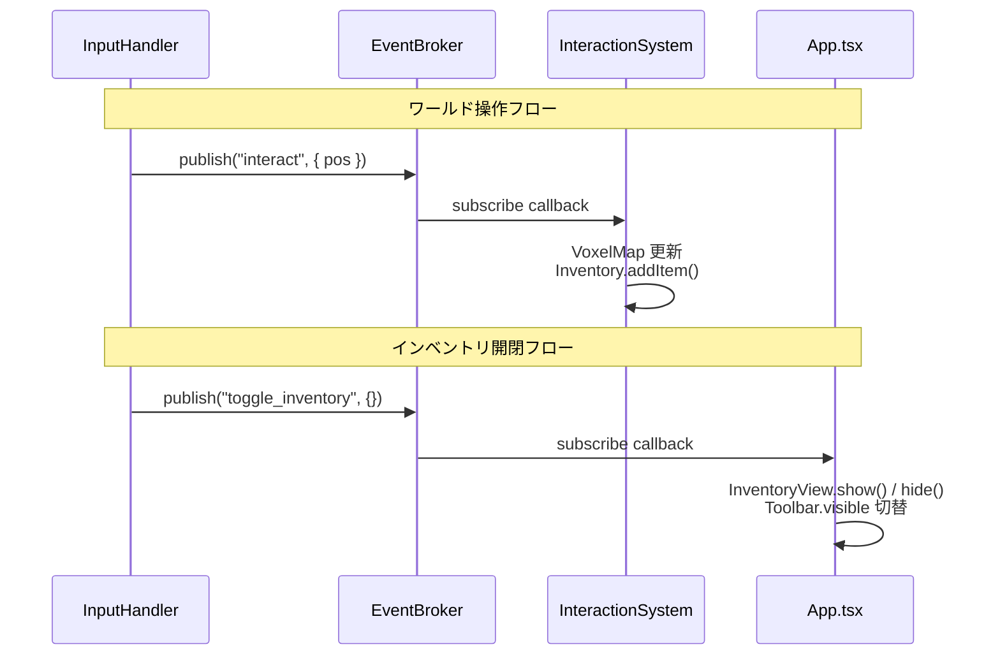

# アーキテクチャドキュメント

## 技術スタック

- **フロントエンド**: React 19 + TypeScript + PixiJS 8
- **バックエンド**: Cloudflare Workers + Hono + D1
- **ビルドツール**: Vite + Bun
- **エントリポイント**: `src/router.tsx`（`index.html` から直接読み込む）
- **React root**: `<body id="root">` に `ReactDOM.createRoot` でマウント
- **React StrictMode**: 使用しない

---

## レイヤー構成と依存関係

依存は一方向を厳守する。下位レイヤーは上位レイヤーを参照してはならない。



> **注意**: `InventoryView → Toolbar` の依存はUIの更新同期のためであり、`view/` 内のみに閉じた例外的な依存である。

---

## 各モジュールの責務

### `src/engine/` — 純粋なゲームロジック（PixiJS 非依存）

| ファイル | 責務 |
|----------|------|
| `Events.ts` | `GameEventMap` 型定義（全イベントの型を一元管理） |
| `ItemDefs.ts` | アイテム ID 型・アイテム定義（スプライト名、スタック上限） |
| `Inventory.ts` | ツールバー（9スロット）と 8×8 インベントリグリッドのデータ管理 |
| `PlayerState.ts` | プレイヤー位置・カメラ位置・ズームレベルの状態管理 |
| `TerrainDefs.ts` | 地形タイプ・エンティティタイプの定数とビットフィールドデコード関数 |
| `TerrainGenerator.ts` | Simplex Noise を用いた 400×400 マップの地形生成 |

### `src/lib/` — 汎用ユーティリティ（ゲームロジック非依存）

| ファイル | 責務 |
|----------|------|
| `Event.ts` | 汎用 `EventBroker<E>` — subscribe/publish による疎結合イベントバス |
| `VoxelMap.ts` | uint32 配列によるボクセルマップのデータ構造とアクセサ |
| `ChunkRenderer.ts` | チャンク単位の PixiJS `RenderTexture` レンダリング |
| `Pool.ts` | オブジェクトプール |

### `src/input/` — 入力処理（PixiJS 依存可）

| ファイル | 責務 |
|----------|------|
| `InputHandler.ts` | キーボード・マウスイベントを受け取り `PlayerState` 更新または `EventBroker` 発行 |
| `InteractionSystem.ts` | `interact` イベントを購読し、選択ツールに応じて `VoxelMap` を操作・`Inventory` を更新 |

### `src/view/` — PixiJS レンダリング・UI

| ファイル | 責務 |
|----------|------|
| `TopView.ts` | ゲームワールドをチャンク単位で描画（`RenderTexture` キャッシュ、ホバーハイライト） |
| `Toolbar.ts` | 画面下部のツールバー UI（スロット選択、スタック数表示） |
| `InventoryView.ts` | Eキーで開閉する 8×8 インベントリ UI（スロット操作、カーソル追従アイコン） |
| `DebugText.ts` | プレイヤー座標・ズームレベルのデバッグ表示 |
| `Sprite.ts` | 複数スプライトシートの非同期読み込み |
| `renderer/TerrainSpriteResolver.ts` | ボクセル値からスプライト名へのマッピング |

### `src/model/GameState.ts` — PixiJS Application 統合

`pixiApp`・`voxelMap`・`playerState`・各 View・`eventBroker` を単一のオブジェクトとして保持するコンテナ。`createGameState()` 非同期ファクトリ関数で生成する。

### `src/App.tsx` — React 層

`useGameEngine` カスタムフックでゲームエンジンの初期化・ゲームループ・クリーンアップを管理する。HMR 時のレースコンディション（async init 中のアンマウント）を `cancelled` フラグと `gameState = null` パターンで防いでいる。

---

## イベントシステム

`EventBroker<GameEventMap>` がコンポーネント間の疎結合を実現する。`GameState.eventBroker` として保持され、登録関数は dispose 関数を返す（dispose パターン）。

```
GameEventMap {
    interact:         { pos: Pos2D }          // 右クリックによるワールド操作
    select_slot:      { slotIndex: number }   // ツールバースロット選択
    toggle_inventory: {}                      // インベントリ開閉（Eキー）
}
```

イベントの発行元と購読先の対応：



---

## ゲームループ

PixiJS の `Application.ticker` を使い、毎フレーム以下を実行する：

1. `InputHandler.tick()` — キー状態に基づき `PlayerState.moveBy()` を呼ぶ
2. `TopView.updateViewport()` — カメラ位置に応じてチャンクを更新・描画
3. `worldContainer.scale.set()` — ズームレベルを反映
4. `DebugText.update()` — 座標表示を更新

---

## データ構造

### VoxelMap ビットフィールド（uint32）

```
bits  0– 7 : 地形タイプ   （TERRAIN_TYPES: empty / water / grass / soil / wetSoil）
bits  8–15 : エンティティ  （ENTITY_TYPES: none / tree）
bits 16–31 : 将来の農業状態（成長段階・水やりフラグ・肥料フラグ等、未使用）
```

JSオブジェクトではなく uint32 配列を使うことでメモリ使用量を抑制している。

### インベントリ

```
ItemStack { itemId: ItemId, count: number }

Inventory
  ├── toolbarSlots:    (ItemStack | null)[] — 9スロット（常時表示）
  └── inventorySlots:  (ItemStack | null)[] — 64スロット（8×8、Eキーで表示）
```

アイテム追加時はインベントリ → ツールバーの順で既存スタックに積み、満杯なら空きスロットに新規作成する。

### アイテム定義

```
ItemDef { id: ItemId, spriteName: string | null, maxStack: number }
```

`spriteName` が `null` のアイテムはスプライトシートに未登録であり、PixiJS Graphics による仮アイコンで表示する。ツール類は `maxStack: 1`、資源アイテム（土・芋）は `maxStack: 64`。

---

## スプライトシート構成

| ファイル | 主な内容 |
|----------|----------|
| `icons-items.spritesheet.json` | ツールアイコン（じょうろ、ピッケル、斧、鎌、シャベル、クワ） |
| `SpringCrops.spritesheet.json` | 農作物スプライト・アイコン（potato_icon、soy_icon 等） |
| `BirchTree.spritesheet.json` | 樹木スプライト（種〜成木 4段階） |
| `TilledSoilAndWetSoil.spritesheet.json` | 耕作地タイルの隣接バリエーション（100種以上） |
| `tileset.spritesheet.json` | 草地・水・崖タイルの大規模バリエーション |
| `TilesetGrass*.spritesheet.json` | 草地・崖・水辺タイルセット（複数ファイル） |
| `walk.spritesheet.json` | キャラクター歩行アニメーション |
| `RobotoBold.fnt` | ビットマップフォント（`BitmapText` で使用） |

スプライトは `Sprite.loadSprite()` で全てを一括ロードしてから、各 View の `initializeSprites()` を呼び出す順序で初期化する。

---

## コーディング規約

- プライベートフィールドに `m_` プレフィックスは使わない
- 不変フィールドは `readonly` public で直接公開（ゲッター不要）
- 可変だがゲッターが必要なフィールドは末尾 `_` で命名（例: `selectedIndex_`）
- イベントリスナー管理は「登録関数が dispose 関数を返す」パターン（nullable フィールドによる管理はしない）
- 単一メソッドのクラスは関数ファクトリに変換する（例: `createInteractionHandler`）
