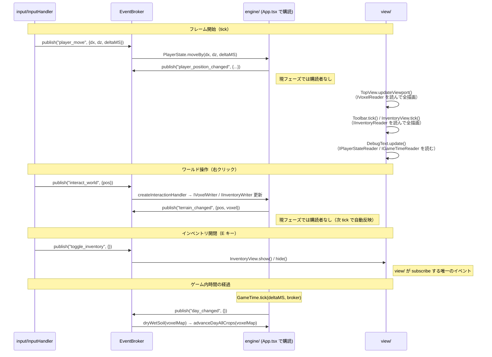

# アーキテクチャドキュメント

> このドキュメントはリアーキテクチャ（`07_RE_ARCHETECTURE.md`）完了後の**現在のアーキテクチャ**を記述する。
> サブエージェントが担当モジュールの実装を始める前に必ず読むこと。

---

## 技術スタック

| 項目 | 採用技術 |
|---|---|
| フロントエンド | React 19 + TypeScript + PixiJS 8 |
| バックエンド | Cloudflare Workers + Hono + D1 |
| ビルドツール | Vite + Bun |
| エントリポイント | `src/router.tsx`（`index.html` から直接読み込む） |
| React root | `<body id="root">` に `ReactDOM.createRoot` でマウント |
| React StrictMode | 使用しない |

---

## ディレクトリ構成

```
src/
  _boundary/               ← 全モジュールが読む境界定義（変更は全員に影響する）
    events.ts              ← GameEventMap（全イベントの型を一元管理）
    interfaces.ts          ← モジュール間インターフェース定義
    constants.ts           ← 共有定数（PIXEL_PER_TILE, TILE_PER_CHUNK）

  engine/                  ← 純粋なゲームロジック（PixiJS 非依存）
    Inventory.ts           ← IInventoryWriter を implements
    PlayerState.ts         ← IPlayerStateWriter を implements
    TerrainDefs.ts         ← 地形・エンティティ定数とビットフィールド操作関数
    TerrainGenerator.ts    ← Simplex Noise による 400×400 マップ生成
    ItemDefs.ts            ← ITEM_DEFS 定数・ItemId 型
    GameTime.ts            ← IGameTimeReader を implements。ゲーム内時間管理
    CropSystem.ts          ← advanceDayAllCrops / dryWetSoil（純粋関数）

  view/                    ← PixiJS レンダリング・UI
    TopView.ts             ← ワールド描画（チャンクキャッシュ、ホバーハイライト）
    Toolbar.ts             ← ツールバー UI
    InventoryView.ts       ← インベントリ UI（Eキーで開閉）
    DebugText.ts           ← デバッグ情報表示
    Sprite.ts              ← スプライトシート非同期読み込み
    Tile.ts                ← タイル描画ヘルパー
    renderer/
      TerrainSpriteResolver.ts  ← ボクセル値 → スプライト名マッピング

  input/                   ← 入力処理（EventBroker へのイベント発行のみ）
    InputHandler.ts        ← キーボード・マウス入力 → EventBroker publish
    InteractionSystem.ts   ← interact_world を購読してワールドを操作

  lib/                     ← 汎用ユーティリティ（ゲームロジック非依存）
    Event.ts               ← 汎用 EventBroker<E>（pub-sub）
    VoxelMap.ts            ← IVoxelWriter を implements
    ChunkRenderer.ts       ← チャンク単位の RenderTexture レンダリング
    Pool.ts                ← オブジェクトプール

  App.tsx                  ← React 層 + DI コンテナ + ゲームループ
  router.tsx               ← React エントリポイント
```

> `model/GameState.ts` はリアーキテクチャで廃止。`App.tsx` がその役割を担う。
> `engine/Events.ts` も廃止。`_boundary/events.ts` に統合済み。

---

## 依存関係とモジュール境界

### 依存方向（厳守）

```
App.tsx（DI コンテナ）
  ↓ 依存・インスタンス化
input/  ──── EventBroker.publish ────→  engine/（App.tsx で subscribe をワイヤリング）
engine/ ──── EventBroker.publish ────→  （現フェーズでは購読者なし。将来の最適化用）
view/   ──── IXxxReader 経由で読む ──→  engine/ の状態（tick() 内で毎フレーム完全描画）

全モジュール ↓ 参照
_boundary/（型・インターフェース定義のみ）
```

### 禁止事項

- `view/` から `engine/` 具体クラスへの直接 import（インターフェース経由のみ）
- `engine/` から `view/` への import（一切禁止）
- `input/` から engine の具体クラスへの直接メソッド呼び出し（EventBroker 経由のみ）
- `view/` が `engine/` 発行イベント（`terrain_changed` 等）を購読する（tick で全描画するため不要）

### 許可される例外

`engine/ItemDefs.ts`・`engine/TerrainDefs.ts` は PixiJS 非依存の**純粋定数・関数のみ**を持つファイルであり、`view/` や `input/` から直接 import してよい。禁止しているのは「具体クラスへの直接 import」であって、純粋定数・関数は対象外。

---

## 設計原則

> **「入力→エンジン間はイベント、描画は tick ごとに状態から純粋関数的に出力」**

| 通信の種類 | 手段 |
|---|---|
| input → engine の操作通知 | `EventBroker.publish` |
| engine 内部の変化通知 | `EventBroker.publish`（現フェーズでは購読者なし。将来の最適化用） |
| view が状態を読む | `IXxxReader` インターフェース経由（tick 内で直接アクセス） |
| view が「何かが起きた」を受け取る | 原則として tick のみ（例外: `toggle_inventory` のみ subscribe） |

**tick ベース描画の理由**: フィジビリティスタディ段階ではゲームルールが頻繁に変わる。「tick ごとに完全な状態から画面を生成する」方針なら状態が正しければ必ず画面が正しく、イベント購読漏れによるバグが起きない。

---

## `_boundary/` 詳細

### `_boundary/events.ts` — イベントカタログ

全モジュールが参照する唯一のイベント型定義ファイル。**追加・変更は全サブエージェントに影響するため、自分で行ってから各エージェントを起動すること。**

```typescript
export type GameEventMap = {
    // ─── UI イベント ──────────────────────────────────────────────────────────
    select_slot:        { slotIndex: number };
    toggle_inventory:   Record<string, never>;   // view/ が subscribe する唯一の UI イベント

    // ─── input → engine ───────────────────────────────────────────────────────
    player_move:        { dx: number; dz: number; deltaMS: number };
    interact_world:     { pos: Pos2D };
    zoom_change:        { delta: number };

    // ─── engine 発行（将来の最適化用。現フェーズでは購読者なし） ────────────
    terrain_changed:    { pos: Pos3D; voxel: number };
    inventory_changed:  { slotIndex: number; isToolbar: boolean; stack: { itemId: string; count: number } | null };
    player_position_changed: { posInWorld: Pos2D; zoomLevel: number };

    // ─── engine 発行: ゲーム内時間 ──────────────────────────────────────────
    day_changed:        Record<string, never>;   // 発行: GameTime / 購読: App.tsx → CropSystem

    // ─── engine 内部（ゲームロジック間の通知） ───────────────────────────────
    crop_planted:       { pos: Pos2D; cropType: string };
    crop_watered:       { pos: Pos2D };
    crop_harvested:     { pos: Pos2D; itemId: string; count: number };
    tree_felled:        { pos: Pos2D };
};
```

### `_boundary/interfaces.ts` — モジュール間インターフェース

`view/` と `input/` はここから import する。`engine/` 具体クラスを直接 import しない。

| インターフェース | 実装クラス | 用途 |
|---|---|---|
| `IVoxelReader` | `VoxelMap` | view/ が地形を読む（書き込み不可） |
| `IVoxelWriter` | `VoxelMap` | engine/ が地形を書き換える |
| `IInventoryReader` | `Inventory` | view/ がインベントリを読む |
| `IInventoryWriter` | `Inventory` | engine/ がインベントリを操作する |
| `IPlayerStateReader` | `PlayerState` | view/ がプレイヤー状態を読む |
| `IPlayerStateWriter` | `PlayerState` | engine/ がプレイヤー状態を更新する |
| `IGameTimeReader` | `GameTime` | view/ がゲーム内時刻を読む |
| `IEventBroker` | `EventBroker<GameEventMap>` | 全モジュールがイベントを pub/sub する |

共有データ型もここで正規定義する:

```typescript
export type ItemStack = { itemId: ItemId; count: number };
export type SlotArea  = "toolbar" | "inventory";
export type SlotRef   = { area: SlotArea; index: number };
// Pos2D, Pos3D, ItemId も re-export（lib/ や engine/ を直接見なくてよい）
```

### `_boundary/constants.ts` — 共有定数

```typescript
export const PIXEL_PER_TILE = 16;   // スプライトのピクセルサイズ
export const TILE_PER_CHUNK = 16;   // チャンク1辺のタイル数
```

---

## 各モジュールの責務

### `src/engine/` — 純粋なゲームロジック（PixiJS 非依存）

| ファイル | 責務 |
|---|---|
| `Inventory.ts` | ツールバー（9スロット）と 8×8 インベントリグリッドのデータ管理。`IInventoryWriter` を implements |
| `PlayerState.ts` | プレイヤー位置・カメラ位置・ズームレベルの状態管理。`IPlayerStateWriter` を implements |
| `TerrainDefs.ts` | `TERRAIN_TYPES`・`ENTITY_TYPES` 定数とビットフィールド操作関数。純粋定数・関数のみ |
| `TerrainGenerator.ts` | Simplex Noise を使った 400×400 マップの地形生成 |
| `ItemDefs.ts` | `ItemId` 型・`ITEM_DEFS` 定数（スプライト名・スタック上限）。純粋定数のみ |
| `GameTime.ts` | ゲーム内時間管理。1日=10分。毎フレーム `tick(deltaMS, broker)` を呼ぶ。朝5時通過で `day_changed` 発行 |
| `CropSystem.ts` | `advanceDayAllCrops(voxelMap)`・`dryWetSoil(voxelMap)` の純粋関数。`day_changed` 受信時に App.tsx が呼ぶ |

**EventBroker の注入パターン**: `VoxelMap`・`PlayerState`・`Inventory` は `setEventBroker(broker)` で後から broker を注入する。地形生成中のイベント洪水を防ぐため、`generateTerrain()` 完了後に注入する。

### `src/lib/` — 汎用ユーティリティ（ゲームロジック非依存）

| ファイル | 責務 |
|---|---|
| `Event.ts` | 汎用 `EventBroker<E>`。`subscribe` は dispose 関数を返す |
| `VoxelMap.ts` | uint32 配列によるボクセルマップ。`IVoxelWriter` を implements |
| `ChunkRenderer.ts` | チャンク単位の PixiJS `RenderTexture` レンダリング。stride をコンストラクタでキャッシュ |
| `Pool.ts` | オブジェクトプール |

### `src/input/` — 入力処理（EventBroker へのイベント発行のみ）

| ファイル | 責務 |
|---|---|
| `InputHandler.ts` | キーボード・マウスイベントを受け取り EventBroker へ publish。`setListeners()` でリスナー登録、`tick(deltaMS)` で毎フレームキー状態に応じて `player_move` 等を発行 |
| `InteractionSystem.ts` | `interact_world` を購読し、選択ツールに応じて `IVoxelWriter`・`IInventoryWriter` を操作する関数ファクトリ `createInteractionHandler()` |

`setPointerPosInWorld()` はイベント経由ではなく `IPlayerStateWriter` を直接呼ぶ（毎フレームの高頻度呼び出しのため）。

### `src/view/` — PixiJS レンダリング・UI

| ファイル | 責務 |
|---|---|
| `TopView.ts` | ゲームワールドをチャンク単位で描画（`RenderTexture` キャッシュ、ホバーハイライト）。`IVoxelReader` 経由 |
| `Toolbar.ts` | 画面下部のツールバー UI。`tick()` で毎フレーム `IInventoryReader` を読んで完全再描画 |
| `InventoryView.ts` | Eキーで開閉する 8×8 インベントリ UI。`tick()` で毎フレーム完全再描画 |
| `DebugText.ts` | プレイヤー座標・ズーム・ゲーム内時刻のデバッグ表示。`IPlayerStateReader`・`IGameTimeReader` 経由 |
| `Sprite.ts` | 複数スプライトシートの非同期一括読み込み |
| `Tile.ts` | タイル描画ヘルパー |
| `renderer/TerrainSpriteResolver.ts` | ボクセル値と近傍情報からスプライト名を決定する純粋関数 |

**SlotIcon プールパターン**: `Toolbar`・`InventoryView` は起動時にスロット数分の `SlotIcon { sprite, graphics, countText }` を事前確保し、毎 tick 内容だけ書き換える（子の追加・削除なし）。

### `src/App.tsx` — React 層 + DI コンテナ + ゲームループ

`useGameEngine` カスタムフックが唯一の DI コンテナとして機能する。

- PixiJS `Application` の初期化・クリーンアップを管理
- 全モジュールをインスタンス化して `EventBroker` 経由でワイヤリング
- `input → engine` の subscribe ハンドラをここで登録（`player_move` → `playerState.moveBy()` 等）
- `day_changed` を購読して `dryWetSoil()` → `advanceDayAllCrops()` を呼ぶ
- HMR 時のレースコンディション対策: `cancelled` フラグ + `pixiApp = null` パターン

---

## データフローの全体像



---

## ゲームループ（tick 順序）

`pixiApp.ticker.add` で毎フレーム以下の順序で実行する:

1. `gameTime.tick(deltaMS, eventBroker)` — 時間を進め、朝5時通過で `day_changed` 発行
2. `inputHandler.tick(deltaMS)` — キー状態に応じて `player_move` 等を発行
3. `topView.updateViewport(posInWorld, pointerPosInWorld)` — チャンク描画
4. `worldContainer.scale.set(playerState.zoomLevel)` — ズーム反映
5. `debugText.update()` — デバッグ表示更新
6. `toolbar.tick()` — ツールバー描画
7. `inventoryView.tick()` — インベントリ描画（`container.visible` が false なら即 return）

---

## データ構造

### VoxelMap ビットフィールド（uint32）

```
bits  0– 7 : 地形タイプ      （TERRAIN_TYPES: empty=0 / water / grass / soil / wetSoil / dirt）
bits  8–15 : エンティティ    （ENTITY_TYPES: none=0 / tree / potato）
bits 16–18 : 作物育成カウンタ（3bit。0=seed / 1〜5=成長段階。MAX=5で収穫可能）
bits 19–31 : 将来用          （水やりフラグ・肥料フラグ等）
```

- JSオブジェクトではなく uint32 配列を使う（OOM 対策）
- 地形タイプのみ変更: `(voxel & ~0xff) | NEW_TERRAIN`
- エンティティのみ変更: `terrain | (entity << 8) | (growthStage << 16)`

### 複数ボクセルにまたがるエンティティ（マルチボクセルエンティティ）

建物・施設など、複数のボクセルを占有するエンティティの設計。**最大フットプリント: 3×2ボクセル（48×32px）**。高さ方向は常に1ボクセル。

#### 設計方針: アンカー + 占有マーカー方式

RimWorld・Dwarf Fortress 等で実績のある手法。

- **アンカーボクセル**: エンティティ情報（種類・状態）を保持する基点ボクセル。通常のエンティティと同じビットフィールドで表現
- **占有ボクセル**: アンカー以外の占有タイルに配置する特殊マーカー。entity = `occupied`（新値）＋アンカーへのオフセットをビットフィールドに格納

#### 占有マーカーのビットフィールド

```
bits  0– 7 : 地形タイプ（現状通り）
bits  8–15 : entity = occupied（専用の定数値）
bits 16–18 : 未使用（マルチボクセルエンティティでは growth counter は不使用）
bits 19–21 : アンカーへの dx オフセット（符号付き3bit、±3範囲）
bits 22–24 : アンカーへの dz オフセット（符号付き3bit、±3範囲）
bits 25–31 : 将来用
```

#### 設置・削除

- **設置時**: 占有予定の全ボクセルが `entity == none` であることを確認してから、アンカーと占有マーカーを一括書き込み
- **削除時**: アンカーを起点に全占有ボクセルを走査してクリア

#### インタラクション

占有ボクセルをクリック → オフセットでアンカーを特定 → アンカーのエンティティに処理を委譲

#### 描画（ChunkRenderer）

チャンクをレンダリングする際、各ボクセルのエンティティに応じて以下を判定する:

| entity の種類 | 描画処理 |
|---|---|
| 通常エンティティ（anchor） | このボクセルを起点に大スプライト（または通常スプライト）を描画。RenderTexture をはみ出す部分は自動クリップ |
| `occupied` | オフセット (dx, dz) を読んでアンカー位置を特定。スプライトの描画起点 = `(現在位置 - オフセット)`（チャンク外でも可）。RenderTexture の自動クリップで境界内分だけ表示される |
| `none` | 描画なし |

`occupied` マーカーのチャンク描画は、現状の崖タイルやトランジションスプライトのはみ出し処理と同じパターンで実装できる。

---

### 座標系

- ワールド座標は xz 平面（y は高さ方向）
- `Pos2D = { x: number; z: number }`（水平座標）
- `Pos3D = { x: number; y: number; z: number }`（3D座標）

### インベントリ

```
Inventory
  toolbarSlots:    (ItemStack | null)[]  — 9スロット（スロット0 = hand 固定、1〜8が通常ツール）
  inventorySlots:  (ItemStack | null)[]  — 64スロット（8×8、Eキーで表示）

ItemStack = { itemId: ItemId; count: number }
```

アイテム追加（`addItem`）: インベントリ → ツールバーの順で既存スタックに積む。満杯なら新規スロット作成。インベントリ満杯時は **操作全体をキャンセル**（voxel 変更しない）。

### アイテム定義

```
ItemDef = { id: ItemId, spriteName: string | null, maxStack: number }
```

`spriteName: null` のアイテムは PixiJS Graphics による仮アイコンで表示。ツール類は `maxStack: 1`、資源アイテムは `maxStack: 64`。スロット0の `hand` は常に固定（消費・交換不可）。

---

## スプライトシート構成

| ファイル | 主な内容 |
|---|---|
| `icons-items.spritesheet.json` | ツールアイコン（じょうろ・ピッケル・斧・鎌・シャベル・クワ） |
| `SpringCrops.spritesheet.json` | 農作物スプライト・アイコン（potato_seed, potato_1〜5, potato_icon 等） |
| `BirchTree.spritesheet.json` | 樹木スプライト（種〜成木 4段階） |
| `TilledSoilAndWetSoil.spritesheet.json` | 耕作地タイルの隣接バリエーション（100種以上） |
| `tileset.spritesheet.json` | 草地・水・崖タイルの大規模バリエーション |
| `TilesetGrass*.spritesheet.json` | 草地・崖・水辺タイルセット（複数ファイル） |
| `walk.spritesheet.json` | キャラクター歩行アニメーション |
| `RobotoBold.fnt` | ビットマップフォント（`BitmapText` で使用） |

スプライトは `loadSprite()` で全一括ロード後、各 View の `initializeSprites()` を呼び出す。

---

## サブエージェント協調開発ガイド

### エージェント一覧と担当範囲

| エージェント名 | 担当ディレクトリ | 主な責務 |
|---|---|---|
| `sg-engine` | `src/engine/` | ゲームロジック（農業・インベントリ・地形・時間・作物）。PixiJS 非依存 |
| `sg-view` | `src/view/` | PixiJS レンダリング・UI（TopView・Toolbar・InventoryView 等） |
| `sg-input` | `src/input/` | 入力受け取りと EventBroker へのイベント発行 |
| `sg-lib` | `src/lib/` | 汎用ユーティリティ（EventBroker・VoxelMap・ChunkRenderer・Pool） |

### モジュール分割の判断基準

| タスクの性質 | アプローチ |
|---|---|
| engine ロジックのみ | `sg-engine` 1体 |
| view のみ（UI・描画） | `sg-view` 1体 |
| input + engine（新しい操作の追加） | `sg-input` と `sg-engine` を並列起動 |
| `_boundary/` 変更を伴う（新イベント・新インターフェース） | 先に自分で `_boundary/` を更新してから各エージェントを起動 |
| 単一ファイルの軽微な修正（1〜3行） | サブエージェント不要、直接編集 |
| 複数モジュールにまたがる（変更が小さくても） | 対応エージェントを並列起動する |

**重要**: `_boundary/` の変更（新イベント追加・インターフェース変更）は全モジュールに影響するため、サブエージェントに委譲せず自分で行う。

### エージェントの発行・購読イベント一覧

| エージェント | 発行するイベント | 購読するイベント |
|---|---|---|
| **sg-engine** | `terrain_changed` `inventory_changed` `player_position_changed` `day_changed` `crop_*` `tree_felled` | `player_move` `interact_world` `select_slot` `zoom_change` |
| **sg-view** | なし | `toggle_inventory`（開閉UIのみ。それ以外のengineイベントは現フェーズで購読しない） |
| **sg-input** | `player_move` `interact_world` `select_slot` `toggle_inventory` `zoom_change` | なし |
| **sg-lib** | なし | なし |

### エージェントへの指示テンプレート

```
## タスク
[具体的な実装内容]

## タスク固有の追加情報（あれば）
- _boundary/ に追加済みの新しいイベント/インターフェース: [内容]
- 他エージェントとの連携で前提となる変更: [内容]
```

各エージェントのシステムプロンプト（`.claude/agents/` に定義）が担当領域・制約・コーディング規約を保持しているため、指示はタスク内容に集中してよい。

---

## コーディング規約

### 命名

- プライベートフィールドに `m_` プレフィックスは使わない
- 不変フィールドは `readonly` public で直接公開（ゲッター不要）
- 可変だがゲッターが必要なフィールドには末尾 `_` を使う（例: `selectedIndex_`）

### パターン

- イベントリスナー管理は「登録関数が dispose 関数を返す」パターン（nullable フィールド管理は使わない）
- 単一メソッドのクラスは関数ファクトリに変換する（例: `createInteractionHandler`）
- 過剰な抽象化をしない。3行の類似コードは関数化より直書きを優先する

### モジュール境界

- モジュール境界を越える新しい import を追加するなら `_boundary/interfaces.ts` 経由のみ
- 新しいイベントを追加するなら `_boundary/events.ts` を先に更新する（発行元・想定購読先をコメントで明記）
- `view/` は engine が発行するイベント（`terrain_changed` 等）を購読しない（tick で全描画のため）
- イベントペイロードはシリアライズ可能な plain object のみ（PixiJS オブジェクトや class instance を含めない）
- dispose 関数は必ずモジュールの cleanup で呼ぶ（subscribe の戻り値を変数に保持してから呼ぶ）

### HMR / PixiJS 初期化

- PixiJS は canvas オプションを渡さず自己管理させ、`container.appendChild(pixiApp.canvas)` で追加する
- クリーンアップ時は `destroy(true, { children: true })`（PixiJS が所有する canvas を削除するため）
- async init 内のレースコンディション対策として `cancelled` フラグと `pixiApp = null` パターンを使う
