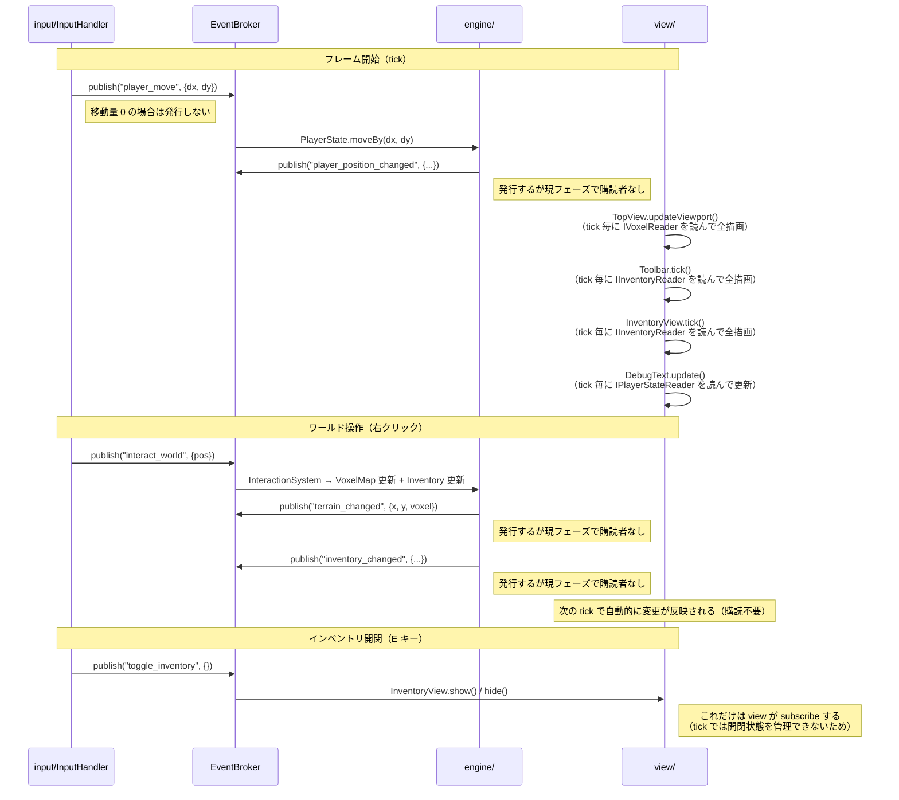

# リアーキテクチャ設計書

> **目的**: コードベースをサブエージェント協調開発に対応した疎結合なアーキテクチャへ移行する。
> **採用方針**: **案1（フルEDA）+ 案3（境界明示型モジュール設計）のハイブリッド**

---

## 背景と課題

### 現状の問題点

1. **`model/GameState.ts` がゴッドオブジェクト**: `pixiApp`・各View・`playerState`・`voxelMap`・`eventBroker` を全て保持しており、変更が全モジュールに波及する
2. **直接参照が多い**: `view/` が `engine/` のオブジェクトを直接参照しており、モジュール境界が曖昧
3. **`EventBroker` の活用が不十分**: 現状は3イベントのみ。大部分の通信が直接メソッド呼び出し
4. **サブエージェントが全コードを読む必要がある**: モジュール間の結合が強く、担当外のコードを知らなければ実装できない

### 移行のゴール

- **サブエージェントは `_boundary/` + 担当モジュールのみを読めば実装できる**
- モジュール間の通信は `EventBroker` 経由（イベント）か `_boundary/interfaces.ts` で定義したインターフェース経由のみ
- 現状よりメモリ増加 +100MB 以内（実際には数MB 以内を目標）

---

## アーキテクチャ概要

### 設計原則

> **「入力→エンジン間はイベント、描画は tick ごとに状態から純粋関数的に出力、エンジンのイベントは将来の最適化のために発行するが現フェーズでは view が購読しない」**

具体的には以下の役割分担を守る：

| 通信の種類 | 手段 | 説明 |
|---|---|---|
| input → engine の"操作通知" | `EventBroker` publish | 移動・インタラクション等 |
| engine 内部の"変化通知" | `EventBroker` publish | 地形変更・インベントリ変更等。現在は購読者なし（将来の最適化用） |
| view が状態を"読む" | インターフェース（tick 内で直接） | `IInventoryReader` 等経由で毎 tick 完全描画 |
| view が"何かが起きた"を受け取る | 原則として tick のみ | キャッシュ無効化などは最適化フェーズで後付け可能 |

### なぜ view を tick ベースにするのか

フィジビリティスタディ段階では、ゲームのルールや機能が頻繁に変わる。そのたびにキャッシュ無効化のロジックを追加・修正するのはバグの温床になる。

**「tick ごとに完全な状態から画面を純粋関数的に生成する」** 方針なら、
- 状態が正しければ必ず画面が正しい（再現性が高い）
- 新機能追加時に描画側の変更が不要（状態を変えるだけ）
- イベントの購読漏れによるバグが起きない

エンジン側のイベント発行（`terrain_changed` 等）は将来の最適化に向けて今から入れておくが、
**現フェーズでは view はこれらを購読せず、tick での全描画のみを行う。**

---

### ディレクトリ構成（移行後）

```
src/
  _boundary/               ← 全サブエージェントが最初に読む境界定義（変更は要全員合意）
    events.ts              ← GameEventMap（全イベントの型を一元管理）
    interfaces.ts          ← モジュール間で共有するインターフェース定義
    constants.ts           ← 共有定数（WorldSize 等）

  engine/                  ← 純粋なゲームロジック（PixiJS 非依存）
    Events.ts              ← 【削除予定】_boundary/events.ts に統合
    Inventory.ts
    PlayerState.ts
    TerrainDefs.ts
    TerrainGenerator.ts
    ItemDefs.ts

  view/                    ← PixiJS レンダリング・UI
    TopView.ts
    Toolbar.ts
    InventoryView.ts
    DebugText.ts
    Sprite.ts
    renderer/
      TerrainSpriteResolver.ts

  input/                   ← 入力処理（イベント発行のみ、engine への直接呼び出しなし）
    InputHandler.ts
    InteractionSystem.ts

  model/                   ← 【解体予定】薄いDIコンテナとして残すか、App.tsx に統合
    GameState.ts

  lib/                     ← 汎用ユーティリティ（ゲーム非依存）
    Event.ts
    VoxelMap.ts
    ChunkRenderer.ts
    Pool.ts

  App.tsx                  ← React層・ゲームループ
  router.tsx
```

### 依存関係（移行後）

```
全モジュール
    ↓ 読む
_boundary/ （イベント型・インターフェース定義）

input/  ──publish──→  EventBroker  ──subscribe──→  engine/
engine/ ──publish──→  EventBroker  （現フェーズでは view は購読しない。将来の最適化用）

view/   ──reads via interface──→  IInventoryReader / IPlayerStateReader / IVoxelReader
        （tick() で毎フレーム状態を読んで完全描画）
```

**禁止事項:**
- `view/` から `engine/` 具体クラスへの直接 import（インターフェース経由のみ）
- `engine/` から `view/` への import（一切禁止）
- `input/` から engine の具体クラスへの直接メソッド呼び出し（EventBroker 経由のみ）

---

## `_boundary/` 詳細設計

### `_boundary/events.ts` — イベントカタログ

全モジュールが参照する唯一のイベント型定義ファイル。**このファイルの変更は全サブエージェントに影響するため、追加・変更には注意する。**

```typescript
import type { Pos2D } from "./interfaces";

export type GameEventMap = {
  // ─── input → engine ─────────────────────────────────────────────────
  // これらは engine が subscribe して状態を更新する

  /** プレイヤー移動要求（InputHandler が毎 tick、移動量が 0 でない場合のみ発行） */
  player_move: { dx: number; dy: number };

  /** ワールドへのインタラクション（右クリック） */
  interact_world: { pos: Pos2D };

  /** ツールバースロット選択 */
  select_slot: { slotIndex: number };

  /** インベントリ開閉トグル（E キー） */
  toggle_inventory: Record<string, never>;

  /** ズーム変更 */
  zoom_change: { delta: number };

  // ─── engine → ??? （将来の最適化用。現フェーズでは購読者なし）────────
  // engine が状態変化時に発行する。view は現在 subscribe していない。
  // 将来、特定の描画最適化（チャンクキャッシュ無効化など）が必要になった時点で
  // view 側が subscribe を追加する。

  /** 地形ボクセル変更（将来: TopView のチャンクキャッシュ無効化に使う） */
  terrain_changed: { x: number; y: number; voxel: number };

  /** インベントリのスロット変更（将来: UI の差分更新に使う） */
  inventory_changed: {
    slotIndex: number;
    isToolbar: boolean;
    stack: { itemId: string; count: number } | null;
  };

  /** プレイヤー位置・カメラ位置変更（将来: 位置依存の最適化に使う） */
  player_position_changed: {
    x: number;
    y: number;
    cameraX: number;
    cameraY: number;
    zoom: number;
  };

  // ─── engine 内部（ゲームロジック間の通知） ───────────────────────────
  // engine 内の複数システム間で使う。view/input は原則として subscribe しない。

  /** 作物が植えられた */
  crop_planted: { pos: Pos2D; cropType: string };

  /** 作物に水やりされた */
  crop_watered: { pos: Pos2D };

  /** 作物が収穫された */
  crop_harvested: { pos: Pos2D; itemId: string; count: number };

  /** 木が伐採された */
  tree_felled: { pos: Pos2D };
};
```

> **既存イベントとの対応:**
> `interact` → `interact_world`（同じ意味、名前を明確化）
> `select_slot` → そのまま維持
> `toggle_inventory` → そのまま維持

---

### `_boundary/interfaces.ts` — モジュール間インターフェース

モジュール間でオブジェクトを渡す際は、具体クラスではなくここのインターフェースを使う。

```typescript
// ─── 共通型 ───────────────────────────────────────────────────

export type Pos2D = { x: number; y: number };

export type ItemStack = { itemId: string; count: number };

// ─── 読み取り専用インターフェース ──────────────────────────────

/**
 * ボクセルマップの読み取りインターフェース。
 * view/ と engine/ がこれを通じて地形データを読む。
 */
export interface IVoxelReader {
  readonly width: number;
  readonly height: number;
  getVoxel(x: number, y: number): number;
}

/**
 * ボクセルマップの書き込みインターフェース（engine/ のみが使う）。
 */
export interface IVoxelWriter extends IVoxelReader {
  setVoxel(x: number, y: number, value: number): void;
}

/**
 * インベントリの読み取りインターフェース（view/ が tick で参照する）。
 */
export interface IInventoryReader {
  readonly toolbarSlots: ReadonlyArray<ItemStack | null>;
  readonly inventorySlots: ReadonlyArray<ItemStack | null>;
  readonly selectedIndex: number;
}

/**
 * インベントリの書き込みインターフェース（engine/ のみが使う）。
 */
export interface IInventoryWriter extends IInventoryReader {
  addItem(itemId: string, count: number): boolean;
  removeItem(slotIndex: number, isToolbar: boolean, count: number): boolean;
  setSelectedIndex(index: number): void;
}

/**
 * プレイヤー状態の読み取りインターフェース（view/ が tick で参照する）。
 */
export interface IPlayerStateReader {
  readonly x: number;
  readonly y: number;
  readonly cameraX: number;
  readonly cameraY: number;
  readonly zoom: number;
}

/**
 * プレイヤー状態の書き込みインターフェース（engine/ のみが使う）。
 */
export interface IPlayerStateWriter extends IPlayerStateReader {
  moveBy(dx: number, dy: number): void;
  adjustZoom(delta: number): void;
  setPointerPosInWorld(wx: number, wy: number): void;
}

// ─── EventBroker ─────────────────────────────────────────────

import type { GameEventMap } from "./events";

/**
 * イベントバスのインターフェース。
 * 全モジュールがこれを通じてイベントを publish/subscribe する。
 */
export interface IEventBroker {
  publish<T extends keyof GameEventMap>(topic: T, packet: GameEventMap[T]): void;
  subscribe<T extends keyof GameEventMap>(
    topic: T,
    listener: (packet: GameEventMap[T]) => void
  ): () => void; // dispose 関数を返す
}
```

---

### `_boundary/constants.ts` — 共有定数

```typescript
/** ワールドのボクセルサイズ */
export const WORLD_WIDTH = 400;
export const WORLD_HEIGHT = 400;

/** チャンクサイズ（何ボクセル × 何ボクセルを1チャンクにするか） */
export const CHUNK_SIZE = 16;

/** 1ボクセルの画面上のピクセルサイズ（基準ズーム時） */
export const TILE_SIZE = 32;
```

---

## サブエージェント分割設計

### 各エージェントの担当と読むファイル

| エージェント | 担当領域 | 読む必須ファイル | 発行するイベント | 購読するイベント |
|---|---|---|---|---|
| **A: engine** | ゲームロジック（農業・インベントリ・地形） | `_boundary/events.ts` `_boundary/interfaces.ts` `src/engine/**` | `terrain_changed` `inventory_changed` `player_position_changed` `crop_*` `tree_felled` | `player_move` `interact_world` `select_slot` `zoom_change` |
| **B: view** | PixiJS レンダリング・UI | `_boundary/events.ts` `_boundary/interfaces.ts` `src/view/**` | なし | `toggle_inventory`（開閉UIのみ）※それ以外のengineイベントは現フェーズで購読しない |
| **C: input** | キーボード・マウス入力 | `_boundary/events.ts` `src/input/**` | `player_move` `interact_world` `select_slot` `toggle_inventory` `zoom_change` | なし |
| **D: lib** | 汎用ユーティリティ | `src/lib/**` `_boundary/interfaces.ts` | なし | なし |

### エージェントへの指示テンプレート

サブエージェントに指示を出す際は以下の形式を使う：

```
あなたは StellaGarden の [担当領域] 担当エージェントです。

## 必ず最初に読むファイル
1. doc/07_RE_ARCHETECTURE.md（このドキュメント）
2. _boundary/events.ts（イベントカタログ）
3. _boundary/interfaces.ts（モジュール間インターフェース）
4. [担当ファイル一覧]

## あなたが発行するイベント
[一覧]

## あなたが購読するイベント
[一覧]

## タスク
[具体的な実装内容]

## 制約
- engine/ を直接 import しないこと（インターフェース経由のみ）
- EventBroker 経由でないモジュール間通信を追加しないこと
- view/ は terrain_changed / inventory_changed 等 engine 発行イベントを購読しないこと
  （tick() で毎フレーム完全描画する方針のため）
```

---

## 移行フェーズ

### フェーズ1: 境界定義の作成（影響範囲: 最小）

**目標**: `_boundary/` を作成し、既存コードを変えずに型定義だけ移動する。

- [ ] `src/_boundary/` ディレクトリを作成
- [ ] `src/_boundary/events.ts` を作成（`src/engine/Events.ts` の内容を拡張して移動）
- [ ] `src/_boundary/interfaces.ts` を作成（新規）
- [ ] `src/_boundary/constants.ts` を作成（`WORLD_WIDTH` 等を集約）
- [ ] `src/engine/Events.ts` を `_boundary/events.ts` を re-export するだけのファイルに変更（後方互換）
- [ ] `src/engine/PlayerState.ts` が `IPlayerStateWriter` を implements するよう変更
- [ ] `src/engine/Inventory.ts` が `IInventoryWriter` を implements するよう変更
- [ ] `src/lib/VoxelMap.ts` が `IVoxelWriter` を implements するよう変更

**成功基準**: ビルドが通り、ゲームが動作すること。

---

### フェーズ2: `view/` の依存をインターフェースに置き換え

**目標**: `view/` 各クラスのコンストラクタ引数を具体クラスからインターフェースに変更する。

- [ ] `TopView` のコンストラクタ: `VoxelMap` → `IVoxelReader`
- [ ] `Toolbar` のコンストラクタ: `Inventory` → `IInventoryReader`
- [ ] `InventoryView` のコンストラクタ: `Inventory` → `IInventoryReader`
- [ ] `DebugText` のコンストラクタ: `PlayerState` → `IPlayerStateReader`
- [ ] `view/` から `engine/` への import がすべてインターフェース経由になっていることを確認

**成功基準**: `view/` ファイルが `src/engine/` を直接 import していないこと。

---

### フェーズ3: `input/` をイベント発行のみに変更

**目標**: `InputHandler` と `InteractionSystem` が engine のオブジェクトを直接操作せず、イベント発行だけを行う。engine 側でイベントを受け取って状態を変更する。

- [ ] `InputHandler.tick()` を修正:
  - `playerState.moveBy()` の直接呼び出し → `broker.publish('player_move', { dx, dy })` に変更（移動量 0 の場合は発行しない）
  - `playerState.adjustZoom()` の直接呼び出し → `broker.publish('zoom_change', { delta })` に変更
- [ ] `InteractionSystem` を修正:
  - `interact` → `interact_world` に rename（`_boundary/events.ts` 側で対応済み）
- [ ] `engine/` 側に `player_move` を購読して `PlayerState` を更新するロジックを追加
- [ ] `engine/` 側に `zoom_change` を購読して `PlayerState` を更新するロジックを追加

**成功基準**: `input/` から `engine/` への直接 import がなくなること。

---

### フェーズ4: `engine/` がイベントを発行するように変更

**目標**: 地形変更・インベントリ変更時に engine がイベントを発行する。**ただし、view は現フェーズでこれらを購読しない。** 将来の最適化（チャンクキャッシュ無効化、差分 UI 更新等）のためにイベント発行のみを先行して入れておく。

- [ ] ボクセル変更後に `terrain_changed` を発行（購読者は現時点でなくてよい）
- [ ] インベントリ変更後に `inventory_changed` を発行（購読者は現時点でなくてよい）
- [ ] `PlayerState` の位置変更後に `player_position_changed` を発行（購読者は現時点でなくてよい）
- [ ] 将来の農業ロジック（作物・収穫）用に `crop_planted` / `crop_watered` / `crop_harvested` / `tree_felled` の発行ポイントを確保

> **view 側はフェーズ4で何も変更しない。** tick() での全描画を継続する。
> engine のイベントを購読して最適化したい場合は「最適化フェーズ」として別タスクで行う。

**成功基準**: イベントが発行されていること（EventBroker にデバッグログを仕込んで確認）。既存の描画動作が変わらないこと。

---

### フェーズ5: `model/GameState.ts` の解体

**目標**: `GameState` をなくし、`App.tsx` が DI コンテナの役割を担うか、軽量な `GameContext` に置き換える。

- [ ] `App.tsx` の `useGameEngine` を修正し、各モジュールを直接生成・接続
- [ ] `GameState` を削除するか、PixiJS Application のラッパーだけの極薄クラスに変更
- [ ] 各モジュールが `IEventBroker` のみを通じて連携していることを確認

**成功基準**: `model/GameState.ts` が全モジュールへの参照を持たないこと。

---

## データフローの全体像（移行後）



---

## メモリへの影響試算

| 追加要素 | 追加コスト |
|---|---|
| `EventBroker` のリスナー増加（~20イベント × ~3リスナー） | < 1KB |
| `_boundary/` インターフェース（型定義のみ、実行時コストなし） | 0B |
| イベントペイロードオブジェクト（`player_move` は毎フレーム生成） | GC 管理内、数KB 以内 |
| **合計** | **< 1MB** |

> `player_move` は毎フレーム発行するため、ペイロードオブジェクト `{ dx, dy }` が毎フレーム生成される。
> V8 エンジンはこの規模のショートリブドオブジェクトを効率的に GC するため問題ない。
> 懸念が出た場合はオブジェクトプールを使うか、直接参照（インターフェース経由）に戻す。

---

## コーディング規約（追加分）

既存の規約（`06_ARCHITECTURE.md`）に加えて以下を守る：

1. **モジュール境界を越える新しい import を追加する場合は `_boundary/interfaces.ts` 経由のみ**
2. **新しいイベントを追加する場合は `_boundary/events.ts` を先に更新する**（コメントに発行元と想定購読先を明記）
3. **`view/` から `engine/` の具体クラスを直接 import しない**（`IInventoryReader` 等を使う）
4. **イベントペイロードはシリアライズ可能な plain object のみ**（PixiJS オブジェクトや class instance を含めない）
5. **dispose 関数は必ずモジュールの cleanup で呼ぶ**（subscribe の戻り値を変数に保持してから呼ぶ）
6. **`view/` は engine が発行するイベント（`terrain_changed` 等）を購読しない**（tick で全描画する方針のため。最適化が必要になった時点で別タスクとして対応する）

---

## TODO リスト（実装順）

> 実装を再開する際はこのリストと現在のコードの状態を照合すること。

### Phase 1: 境界定義の作成

- [ ] **[Phase 1-1]** `src/_boundary/events.ts` 作成（拡張版 GameEventMap）
- [ ] **[Phase 1-2]** `src/_boundary/interfaces.ts` 作成（IVoxelReader/Writer, IInventoryReader/Writer, IPlayerStateReader/Writer, IEventBroker）
- [ ] **[Phase 1-3]** `src/_boundary/constants.ts` 作成（WORLD_WIDTH, WORLD_HEIGHT, CHUNK_SIZE, TILE_SIZE）
- [ ] **[Phase 1-4]** `src/engine/Events.ts` を `_boundary/events.ts` の re-export に変更（後方互換のため）
- [ ] **[Phase 1-5]** `src/engine/PlayerState.ts` に `IPlayerStateWriter` を implements
- [ ] **[Phase 1-6]** `src/engine/Inventory.ts` に `IInventoryWriter` を implements
- [ ] **[Phase 1-7]** `src/lib/VoxelMap.ts` に `IVoxelWriter` を implements

### Phase 2: view/ の依存をインターフェースに置き換え

- [ ] **[Phase 2-1]** `view/TopView` コンストラクタ引数を `IVoxelReader` に変更
- [ ] **[Phase 2-2]** `view/Toolbar` コンストラクタ引数を `IInventoryReader` に変更
- [ ] **[Phase 2-3]** `view/InventoryView` コンストラクタ引数を `IInventoryReader` に変更
- [ ] **[Phase 2-4]** `view/DebugText` コンストラクタ引数を `IPlayerStateReader` に変更

### Phase 3: input/ をイベント発行のみに変更

- [ ] **[Phase 3-1]** `InputHandler.tick()` の `playerState.moveBy()` を `player_move` イベント発行に変更
- [ ] **[Phase 3-2]** `InputHandler.tick()` のズーム変更を `zoom_change` イベント発行に変更
- [ ] **[Phase 3-3]** `engine/` 側で `player_move` / `zoom_change` を購読するハンドラを追加

### Phase 4: engine/ がイベントを発行（view は購読しない）

- [ ] **[Phase 4-1]** ボクセル変更後に `terrain_changed` イベントを発行（購読者なしで OK）
- [ ] **[Phase 4-2]** インベントリ変更後に `inventory_changed` イベントを発行（購読者なしで OK）
- [ ] **[Phase 4-3]** `PlayerState` 変更後に `player_position_changed` イベントを発行（購読者なしで OK）

### Phase 5: model/GameState.ts の解体

- [ ] **[Phase 5-1]** `model/GameState.ts` を解体し、`App.tsx` に DI を集約
