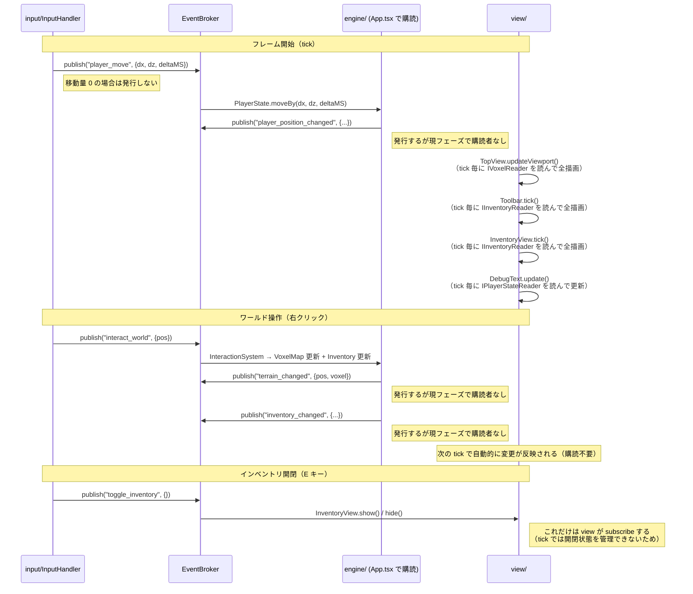

# リアーキテクチャ設計書

> **目的**: コードベースをサブエージェント協調開発に対応した疎結合なアーキテクチャへ移行する。
> **採用方針**: **案1（フルEDA）+ 案3（境界明示型モジュール設計）のハイブリッド**
> **ステータス**: ✅ Phase 1〜5 全完了
>
> **注記（後続拡張との関係）**
>
> この文書はリアーキテクチャ移行時点の設計判断を記録した**基礎設計文書**である。  
> そのため、後続で追加された Registry パターン、`UIState`、灌漑、自動化、粘土再生成、炉UI、肥料物流などの拡張要素は本文にまだ十分反映されていない箇所がある。
>
> ただし、本書の内容が古くなって無効になったわけではない。  
> **モジュール境界・依存方向・イベント駆動・tick ベース描画という原則は現在も有効**であり、後続拡張はその上に積み上がっている。
>
> 読み方のルール:
>
> - **アーキテクチャ原則**は本書を正とする
> - **個別機能の具体仕様**は番号の大きい後続ドキュメントを優先する
> - 特に以下の文書は、本書の原則を前提にした拡張仕様として読む
>   - `13_RE_RE_ARCHETECTURE.md`
>   - `16_IRRIGATION.md`
>   - `17_AUTOMATION.md`
>   - `19_CRAY.md`
>   - `20_FORGE.md`
>   - `21_AUTO_FERTILIZATION.md`
>
> したがって、この文書は「現在の全実装を完全に列挙した最新一覧」ではなく、**現在の実装群を支える土台の設計書**として扱う。

---

## 背景と課題

### 現状の問題点（移行前）

1. **`model/GameState.ts` がゴッドオブジェクト**: `pixiApp`・各View・`playerState`・`voxelMap`・`eventBroker` を全て保持しており、変更が全モジュールに波及する
2. **直接参照が多い**: `view/` が `engine/` のオブジェクトを直接参照しており、モジュール境界が曖昧
3. **`EventBroker` の活用が不十分**: 現状は3イベントのみ。大部分の通信が直接メソッド呼び出し
4. **サブエージェントが全コードを読む必要がある**: モジュール間の結合が強く、担当外のコードを知らなければ実装できない

### 移行のゴール（達成済み）

- ✅ **サブエージェントは `_boundary/` + 担当モジュールのみを読めば実装できる**
- ✅ モジュール間の通信は `EventBroker` 経由（イベント）か `_boundary/interfaces.ts` で定義したインターフェース経由のみ
- ✅ 現状よりメモリ増加 +100MB 以内（実際には数MB 以内を目標）

---

## アーキテクチャ概要

### 設計原則

> **「入力→エンジン間はイベント、描画は tick ごとに状態から純粋関数的に出力、エンジンのイベントは将来の最適化のために発行するが現フェーズでは view が購読しない」**

具体的には以下の役割分担を守る：

| 通信の種類 | 手段 | 説明 |
|---|---|---|
| input → engine の"操作通知" | `EventBroker` publish | 移動・インタラクション等 |
| engine 内部の"変化通知" | `EventBroker` publish | 地形変更・インベントリ変更等。現在は購読者なし（将来の最適化用） |
| view が状態を"読む" | インターフェース（tick 内で直接） | `IInventoryReader` 等経由で毎 tick 完全描画 |
| view が"何かが起きた"を受け取る | 原則として tick のみ | キャッシュ無効化などは最適化フェーズで後付け可能 |

### なぜ view を tick ベースにするのか

フィジビリティスタディ段階では、ゲームのルールや機能が頻繁に変わる。そのたびにキャッシュ無効化のロジックを追加・修正するのはバグの温床になる。

**「tick ごとに完全な状態から画面を純粋関数的に生成する」** 方針なら、
- 状態が正しければ必ず画面が正しい（再現性が高い）
- 新機能追加時に描画側の変更が不要（状態を変えるだけ）
- イベントの購読漏れによるバグが起きない

エンジン側のイベント発行（`terrain_changed` 等）は将来の最適化に向けて今から入れておくが、
**現フェーズでは view はこれらを購読せず、tick での全描画のみを行う。**

---

### ディレクトリ構成（移行完了後）

> **補足**  
> 以下はリアーキテクチャ完了時点の代表構成であり、後続拡張で追加された全ファイルを網羅するものではない。  
> とくに `_registry/`、`UIState`、施設ストレージ系、灌漑・自動化・粘土・炉関連の追加ファイルは後続文書で拡張されている。

```
src/
  _boundary/               ← 全サブエージェントが最初に読む境界定義（変更は要全員合意）
    events.ts              ← GameEventMap（全イベントの型を一元管理）
    interfaces.ts          ← モジュール間で共有するインターフェース定義
    constants.ts           ← 共有定数（PIXEL_PER_TILE, TILE_PER_CHUNK）

  engine/                  ← 純粋なゲームロジック（PixiJS 非依存）
    Inventory.ts           ← IInventoryWriter を implements、EventBroker 経由でイベント発行
    PlayerState.ts         ← IPlayerStateWriter を implements、EventBroker 経由でイベント発行
    TerrainDefs.ts         ← TERRAIN_TYPES, ENTITY_TYPES（純粋定数・関数）
    TerrainGenerator.ts    ← generateTerrain（simplex-noise、400×400 マップ）
    ItemDefs.ts            ← ITEM_DEFS（純粋定数）

  view/                    ← PixiJS レンダリング・UI
    TopView.ts
    Toolbar.ts
    InventoryView.ts
    DebugText.ts
    Sprite.ts
    renderer/
      TerrainSpriteResolver.ts

  input/                   ← 入力処理（イベント発行のみ、engine への直接呼び出しなし）
    InputHandler.ts
    InteractionSystem.ts

  lib/                     ← 汎用ユーティリティ（ゲーム非依存）
    Event.ts               ← EventBroker<E>（汎用 pub-sub）
    VoxelMap.ts            ← IVoxelWriter を implements、EventBroker 経由でイベント発行
    ChunkRenderer.ts
    Pool.ts

  App.tsx                  ← React 層・DI コンテナ・ゲームループ（model/GameState.ts を廃止して統合）
  router.tsx
```

> **注**: `engine/Events.ts` と `model/GameState.ts` は削除済み。  
> **後続拡張の補足**: 現在は `_registry/`、`UIState`、`ChestStorage`、`ForgeStorage` などの追加要素が存在しうるが、いずれも本節の責務分離原則の上に載る。

### 依存関係（移行後）

```
全モジュール
    ↓ 読む
_boundary/ （イベント型・インターフェース定義）

input/  ──publish──→  EventBroker  ──subscribe──→  engine/（App.tsx で購読をワイヤリング）
engine/ ──publish──→  EventBroker  （現フェーズでは view は購読しない。将来の最適化用）

view/   ──reads via interface──→  IInventoryReader / IPlayerStateReader / IVoxelReader
        （tick() で毎フレーム状態を読んで完全描画）
```

**禁止事項:**
- `view/` から `engine/` 具体クラスへの直接 import（インターフェース経由のみ）
- `engine/` から `view/` への import（一切禁止）
- `input/` から engine の具体クラスへの直接メソッド呼び出し（EventBroker 経由のみ）

**許可される例外（純粋データのみ）:**
- `engine/ItemDefs.ts`（`ITEM_DEFS` 定数）と `engine/TerrainDefs.ts`（地形定数・デコード関数）は PixiJS 非依存の純粋データ定義であり、クラスを持たない。これらは `view/` や `input/` から直接 import して構わない。禁止は「具体クラスへの直接 import」であり、純粋定数・関数は対象外。

---

## `_boundary/` 詳細設計

> **補足**  
> 後続拡張でイベントやインターフェースは増えているが、「境界定義を `_boundary/` に集約する」という原則自体は変わっていない。  
> 新しい施設UI、ストレージ、灌漑、自動化、物流の追加も、まず `_boundary/` の定義を起点に整理するのが正しい流れである。

### `_boundary/events.ts` — イベントカタログ

全モジュールが参照する唯一のイベント型定義ファイル。**このファイルの変更は全サブエージェントに影響するため、追加・変更には注意する。**

実際の実装（抜粋）:

```typescript
export type GameEventMap = {
  // ─── UI イベント ──────────────────────────────────────────────────────────
  select_slot: { slotIndex: number };
  toggle_inventory: Record<string, never>;

  // ─── input → engine（Phase 3 以降で使用） ───────────────────────────────
  /** dx, dz は正規化済み方向ベクトル、deltaMS はフレーム時間(ms) */
  player_move: { dx: number; dz: number; deltaMS: number };
  interact_world: { pos: Pos2D };
  zoom_change: { delta: number };

  // ─── engine 発行（将来の最適化用。現フェーズでは購読者なし） ────────────
  terrain_changed: { pos: Pos3D; voxel: number };
  inventory_changed: { slotIndex: number; isToolbar: boolean; stack: { itemId: string; count: number } | null };
  player_position_changed: { posInWorld: Pos2D; zoomLevel: number };

  // ─── engine 内部（ゲームロジック間の通知） ───────────────────────────────
  crop_planted: { pos: Pos2D; cropType: string };
  crop_watered: { pos: Pos2D };
  crop_harvested: { pos: Pos2D; itemId: string; count: number };
  tree_felled: { pos: Pos2D };
};
```

> **設計書ドラフトからの変更点:**
> - `interact` は廃止済み（→ `interact_world`）
> - `player_move` に `deltaMS` を追加（engine の `moveBy()` がフレーム時間を必要とするため）

---

### `_boundary/interfaces.ts` — モジュール間インターフェース

モジュール間でオブジェクトを渡す際は、具体クラスではなくここのインターフェースを使う。

実際の実装（主要部分）:

```typescript
// 共通型（lib/VoxelMap.ts から re-export）
export type { Pos2D, Pos3D } from "../lib/VoxelMap";
export type { ItemId } from "../engine/ItemDefs";
export type ItemStack = { itemId: ItemId; count: number };
export type SlotArea = "toolbar" | "inventory";
export type SlotRef = { area: SlotArea; index: number };

export interface IVoxelReader {
    readonly width: number; height: number; depth: number; horizonHeight: number;
    get(pos: Pos3D): number;
    getSurfacePosition(pos: Pos3D): Pos3D;
}
export interface IVoxelWriter extends IVoxelReader {
    set(voxel: number, pos: Pos3D): void;
    remove(pos: Pos3D): void;
}

export interface IInventoryReader {
    readonly toolbarSlots: ReadonlyArray<ItemStack | null>;
    readonly inventorySlots: ReadonlyArray<ItemStack | null>;
    readonly selectedIndex: number;
    readonly selectedTool: ItemId | null;
}
export interface IInventoryWriter extends IInventoryReader {
    addItem(itemId: ItemId, count: number): boolean;
    selectSlot(index: number): void;
    getSlot(ref: SlotRef): ItemStack | null;
    setSlot(ref: SlotRef, stack: ItemStack | null): void;
    swapSlots(a: SlotRef, b: SlotRef): void;
    consumeSelectedItem(count: number): boolean;
}

export interface IPlayerStateReader {
    readonly posInWorld: Pos2D;
    readonly pointerPosInWorld: Pos2D;
    readonly zoomLevel: number;
    readonly worldSize: Pos2D;
    readonly tilePerViewport: Pos2D;
    readonly inventory: IInventoryReader;
}
export interface IPlayerStateWriter extends IPlayerStateReader {
    moveBy(dx: number, dz: number, deltaMS: number): void;
    adjustZoom(delta: number): void;
    setPointerPosInWorld(x: number, z: number): void;
}

// IEventBroker は lib/Event.ts の EventBroker<GameEventMap> と同一
export type IEventBroker = EventBroker<GameEventMap>;
```

> **設計書ドラフトからの変更点:**
> - 座標系は xz 平面（y は高さ方向。`Pos2D` は `{x, z}`）
> - `IPlayerStateReader` に `worldSize`, `tilePerViewport`, `inventory` を追加
> - `IInventoryWriter` に `getSlot`, `setSlot`, `swapSlots`, `consumeSelectedItem` を追加

---

### `_boundary/constants.ts` — 共有定数

```typescript
export const PIXEL_PER_TILE = 16;   // スプライトのピクセルサイズ
export const TILE_PER_CHUNK = 16;   // チャンク1辺のタイル数
```

---

## サブエージェント分割設計

### 各エージェントの担当と読むファイル

| エージェント | 担当領域 | 読む必須ファイル | 発行するイベント | 購読するイベント |
|---|---|---|---|---|
| **A: engine** | ゲームロジック（農業・インベントリ・地形） | `_boundary/events.ts` `_boundary/interfaces.ts` `src/engine/**` | `terrain_changed` `inventory_changed` `player_position_changed` `crop_*` `tree_felled` | `player_move` `interact_world` `select_slot` `zoom_change` |
| **B: view** | PixiJS レンダリング・UI | `_boundary/events.ts` `_boundary/interfaces.ts` `src/view/**` | なし | `toggle_inventory`（開閉UIのみ）※それ以外のengineイベントは現フェーズで購読しない |
| **C: input** | キーボード・マウス入力 | `_boundary/events.ts` `src/input/**` | `player_move` `interact_world` `select_slot` `toggle_inventory` `zoom_change` | なし |
| **D: lib** | 汎用ユーティリティ | `src/lib/**` `_boundary/interfaces.ts` | なし | なし |

### エージェントへの指示テンプレート

サブエージェントに指示を出す際は以下の形式を使う：

```
あなたは StellaGarden の [担当領域] 担当エージェントです。

## 必ず最初に読むファイル
1. doc/07_RE_ARCHETECTURE.md（このドキュメント）
2. _boundary/events.ts（イベントカタログ）
3. _boundary/interfaces.ts（モジュール間インターフェース）
4. [担当ファイル一覧]

## あなたが発行するイベント
[一覧]

## あなたが購読するイベント
[一覧]

## タスク
[具体的な実装内容]

## 制約
- engine/ の具体クラスを直接 import しないこと（インターフェース経由のみ）
- EventBroker 経由でないモジュール間通信を追加しないこと
- view/ は terrain_changed / inventory_changed 等 engine 発行イベントを購読しないこと
  （tick() で毎フレーム完全描画する方針のため）
- engine/ItemDefs.ts と engine/TerrainDefs.ts は純粋データ定数なので import して構わない
```

---

## 移行フェーズ（全完了）

### フェーズ1: 境界定義の作成 ✅

**目標**: `_boundary/` を作成し、型定義を一元管理する。

- ✅ `src/_boundary/` ディレクトリを作成
- ✅ `src/_boundary/events.ts` を作成（拡張版 GameEventMap）
- ✅ `src/_boundary/interfaces.ts` を作成（IVoxelReader/Writer, IInventoryReader/Writer, IPlayerStateReader/Writer, IEventBroker）
- ✅ `src/_boundary/constants.ts` を作成（PIXEL_PER_TILE, TILE_PER_CHUNK）
- ✅ `src/engine/PlayerState.ts` が `IPlayerStateWriter` を implements
- ✅ `src/engine/Inventory.ts` が `IInventoryWriter` を implements
- ✅ `src/lib/VoxelMap.ts` が `IVoxelWriter` を implements

**備考**: `src/engine/Events.ts` は _boundary/events.ts に統合後、削除済み。

---

### フェーズ2: `view/` の依存をインターフェースに置き換え ✅

**目標**: `view/` 各クラスのコンストラクタ引数を具体クラスからインターフェースに変更する。

- ✅ `TopView` のコンストラクタ: `VoxelMap` → `IVoxelReader`
- ✅ `Toolbar` のコンストラクタ: `Inventory` → `IInventoryReader`
- ✅ `InventoryView` のコンストラクタ: `Inventory` → `IInventoryReader`
- ✅ `DebugText` のコンストラクタ: `PlayerState` → `IPlayerStateReader`

---

### フェーズ3: `input/` をイベント発行のみに変更 ✅

**目標**: `InputHandler` と `InteractionSystem` が engine のオブジェクトを直接操作せず、イベント発行だけを行う。

- ✅ `InputHandler.tick()` の `playerState.moveBy()` → `broker.publish("player_move", { dx, dz, deltaMS })` に変更
- ✅ `InputHandler` のズーム変更 → `broker.publish("zoom_change", { delta })` に変更
- ✅ `InteractionSystem` の `interact` → `interact_world` に変更
- ✅ `App.tsx` で `player_move` / `zoom_change` を購読して `PlayerState` を更新するハンドラを追加

**備考**: `setPointerPosInWorld()` はイベント経由にせず `IPlayerStateWriter` の直接呼び出しのまま維持（毎フレームの高頻度呼び出しで、発行オブジェクトのコスト対効果が低いため）。

---

### フェーズ4: `engine/` がイベントを発行 ✅

**目標**: 地形変更・インベントリ変更時に engine がイベントを発行する（view は購読しない）。

- ✅ `VoxelMap.set()` / `remove()` 後に `terrain_changed` を発行
- ✅ `Inventory.setSlot()` / `consumeSelectedItem()` 後に `inventory_changed` を発行
- ✅ `PlayerState.moveBy()` / `adjustZoom()` 後に `player_position_changed` を発行
- ✅ `setEventBroker()` パターンで broker を後から注入（地形生成中のイベント洪水を防ぐ）

**備考**: `Inventory.addItem()` は複数スロットに影響するため `inventory_changed` を発行しない（view は tick で全描画するため問題なし）。将来の最適化時に対応する。

---

### フェーズ5: `model/GameState.ts` の解体 ✅

**目標**: `GameState` をなくし、`App.tsx` が DI コンテナの役割を担う。

- ✅ `App.tsx` の `useGameEngine` フックに全初期化を統合
- ✅ `model/GameState.ts` を削除
- ✅ 各モジュールが `IEventBroker` のみを通じて連携していることを確認

---

## データフローの全体像（現在）

> **後続拡張との関係**  
> 現在はチェストUI、炉UI、粘土再生成、灌漑、自動化物流などの追加要素があるが、基本の流れは変わらない。  
> すなわち、
>
> - `input/` がイベントを publish
> - `engine/` が状態を更新
> - `view/` は tick ごとに Reader interface や UI 状態を読む
>
> という構造を維持している。  
> 追加された `UIState` や各種ストレージクラスも、この流れを壊さずに組み込まれる。



---

## コーディング規約（追加分）

> **後続拡張の読み替え**  
> 現在は Registry パターンの導入により、「新しい作物・施設・アイテム・地形の振る舞い追加は `_registry/` に集約する」という追加規約が存在する。  
> ただしそれは本書の規約と矛盾せず、むしろ「モジュール境界を明示し、担当範囲を局所化する」という本書の目的をさらに推し進めたものとして理解する。

既存の規約（`06_ARCHITECTURE.md`）に加えて以下を守る：

1. **モジュール境界を越える新しい import を追加する場合は `_boundary/interfaces.ts` 経由のみ**
2. **新しいイベントを追加する場合は `_boundary/events.ts` を先に更新する**（コメントに発行元と想定購読先を明記）
3. **`view/` から `engine/` の具体クラスを直接 import しない**（`IInventoryReader` 等を使う）
4. **イベントペイロードはシリアライズ可能な plain object のみ**（PixiJS オブジェクトや class instance を含めない）
5. **dispose 関数は必ずモジュールの cleanup で呼ぶ**（subscribe の戻り値を変数に保持してから呼ぶ）
6. **`view/` は engine が発行するイベント（`terrain_changed` 等）を購読しない**（tick で全描画する方針のため。最適化が必要になった時点で別タスクとして対応する）
7. **`engine/ItemDefs.ts`・`engine/TerrainDefs.ts` は例外**: 純粋データ定数・関数のみを持つファイルは `view/` や `input/` から直接 import してよい。禁止しているのは「具体クラスへの直接 import」。

---

## メモリへの影響試算

| 追加要素 | 追加コスト |
|---|---|
| `EventBroker` のリスナー増加（~20イベント × ~3リスナー） | < 1KB |
| `_boundary/` インターフェース（型定義のみ、実行時コストなし） | 0B |
| イベントペイロードオブジェクト（`player_move` は毎フレーム生成） | GC 管理内、数KB 以内 |
| **合計** | **< 1MB** |

> `player_move` は毎フレーム発行するため、ペイロードオブジェクト `{ dx, dz, deltaMS }` が毎フレーム生成される。
> V8 エンジンはこの規模のショートリブドオブジェクトを効率的に GC するため問題ない。
> 懸念が出た場合はオブジェクトプールを使うか、直接参照（インターフェース経由）に戻す。
